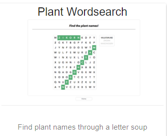

# Search for Words

In search4words players need to find the set of given words in the crosswords field.



## Getting Started

These instructions will get you a copy of the project up and running on your local machine for development and testing purposes. See deployment for notes on how to deploy the project on a live system.

### Installing

Dependencies are been migrated from [Bower](https://bower.io/) with [bower-away](https://github.com/sheerun/bower-away). Therefore yarn or npm may be used for installing
the dependencies.

As indicated in **Bower** official site, it is recommended not to use it to manage the dependencies.

```
yarn
```
or
```
npm install
```

You can use any static server of your choice to serve the files for the webpage.
Additionally, [webpack](https://webpack.js.org/) may be used for compiling the source code
and package it into a few files (friendlier with download speed for the webpage).

**This prototype needs for an ElasticSearch database, and an [API](https://github.com/acdh-oeaw/exploreAT-collectionexplorer-api) for retrieving data from Europeana and Flickr.**

## Authors

* [Antonio Losada](https://github.com/notsomes) - *Implementation of the prototype* 
* [Alejandro Rodríguez](https://github.com/Janchorizo) - *Migration to newer package manager* 

## License

This project is licensed under the MIT License - see the [LICENSE.md](LICENSE.md) file for details
